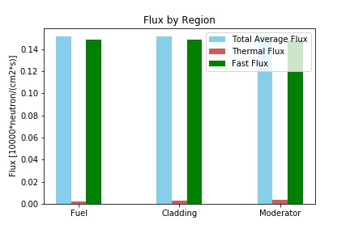
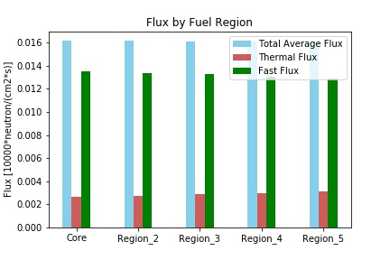
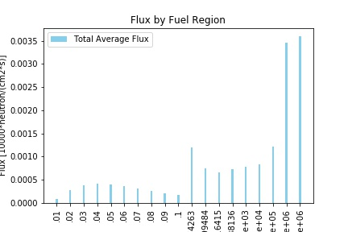

All input files are in the 4HW directory. Each input file used in this assignment is included.  For question 4, the mod files is what was used to find the radius of the sphere to reach criticality. In the outputs folder, each question has a sub folder with the MCNP output text file.  

Plotting was done in the Jupyter Notebook, and several calculations were done in the Mathematica notebook, both are included in the repo.  

# Solutions for 4

## Lady Godiva original code:
Keff = .9978

## 4a- 50 at% enrichment:
Keff = .7160

Criticality achieved at R= 12.68 cm  
Keff = 1.003  
Mass fuel = 4*Pi*12.68^3 [cm^3]* 18.74[g/cm^3] = 479337.5 [g]

## 4b- 50 at% and lead shield
Keff = .8601  

Criticality achieved at R= 11.00 cm  
Note=Lead shield kept at 10cm thickness  
Keff = 1.04  
Mass fuel = 4*Pi*11.00^3 [cm^3]* 18.74[g/cm^3] = 312940.4 [g]
# Solutions for 5

## k_inf
Since boundary conditions are reflective:
K_inf = K_eff = 1.29527
## Average total flux value in the fuel, clad and moderator [10000*n/cm^2*s]
-  Fuel: 1.51250E-01
-  Cladding:  1.51591E-01
-  Moderator: 1.51588E-01
## Average thermal  and fast flux in fuel, clad and moderator  [10000*n/cm^2*s]
Thermal:
-  Fuel: 2.46509E-03
-  Cladding: 2.97126E-03
-  Moderator:  3.36391E-03  
Fast:
-  Fuel: 1.48731E-01
-  Cladding:  1.48567E-01
-  Moderator: 1.48172E-01
## Plot of average total, thermal, and fast flux in fuel, clad and moderator


The shape of the flux in each region is not what I expected to see. I anticipated a higher thermal flux in the moderator, and while it is slightly higher, it is still not showing a large thermal population. This is possibly due to the energy bins we are looking at in the tally card. Since we are defining thermal from 0-.1 eV and Fast from .1ev - 10 MeV, the relative population of the "Fast" group will obviously dominate the population.
Additionally, there is minimal change in flux between each region.  

## Total fission and capture rate in the fuel [10000*n/s]
Fission = 5.18457E-02
Capture = 4.50434E-02

# Solutions for 6

## Average total, thermal and fast flux values in each fuel volume [10000*n/cm^2*s]
See Mathematica notebook for fuel radius calculation.
-  Vol1 (core)
Total= 1.61809E-02  
Thermal = 2.66372E-03  
Fast = 1.35076E-02  
-  Vol2
Total= 1.61690E-02  
Thermal = 2.76299E-03  
Fast = 1.33967E-02  
-  Vol3
Total=  1.61309E-02  
Thermal = 2.86679E-03  
Fast = 1.32550E-02  
-  Vol4
Total= 1.60925E-02  
Thermal = 2.99604E-03  
Fast = 1.30875E-02  
-  Vol5
Total= 1.60389E-02  
Thermal = 3.16416E-03  
Fast = 1.28662E-02  

## Plot of fuel volume flux


The thermal flux is increased in with the multiple fuel cell volumes.  I assume MCNP is better able to model how the fuel effects the neutrons when it is broken up into different regions.
## Plot of fine energy distribution


The energy bins are in units of eV and keep getting cut off in the save fig function, see the jupyter notebook for source image and code.

# DCEF Insturctions

1) Log on as ne150-03@kepler.berkeley.edu

```
ssh ne150-03@kepler.berkeley.edu
PW: ##############
ssh foxtrot
PW: ##############
mcnp5 inp=F_NAME.inp
```

If not already added to bash you need to link in mcnp5 libs

```
setenv DATAPATH /usr/local/mcnp5_lib-160  
```
